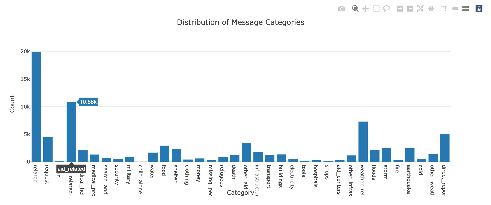
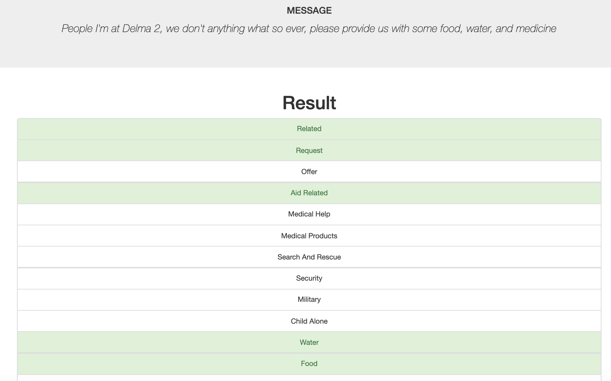

# Disaster Response Pipelines




## Project Motivation

To utilize the [real life disaster datasets](https://github.com/kazuhirokomoda/disaster-response-pipelines/tree/master/data) provided by [Figure Eight](https://appen.com/) to perform the followings:

- Build an ETL Pipeline to clean the data.
- Build a supervised learning model to categorize messages, using scikit-learn `Pipeline` and `FeatureUnion`.
- Build a Flask web app to:
  - Take an user input message and get the classification results for 36 categories (ex. `aid_related`, `weather_related`, `direct_report`, etc.).
  - Display visualizations to describe the datasets.

## Installation

### Dependencies

In addition to the [Anaconda distribution of Python (versions 3.\*)](https://www.anaconda.com/products/individual-b), following libraries need to be installed manually.

- [plotly](https://plotly.com/python/)

### How to run the project

1. Navigate yourself to the project's root directory.

2. To run ETL pipeline that cleans data and stores in database:

```
python data/process_data.py data/disaster_messages.csv data/disaster_categories.csv data/DisasterResponse.db
```

3. To run ML pipeline that trains classifier and saves it:

```
python models/train_classifier.py data/DisasterResponse.db models/classifier.pkl
```

4. To run the web app:

```
cd app; pwd
python run.py
```

5. Finally, go to http://0.0.0.0:3001/ to find visualizations describing the dataset. You can also input text message to see which categories it falls into, according to the trained model's prediction.

## File Descriptions

- `data/` directory includes ETL script `process_data.py` to clean data and stores in a SQLite database
- `models/` directory includes ML script `train_classifier.py` to train a classifier and store it into a pickle file
- `app/` directory includes web app `run.py` to handle visualizations using data from SQLite database

## Note on the class imbalance of this dataset

As we see from the screenshot above, this dataset is imbalanced. For reference, [This Google document](https://developers.google.com/machine-learning/data-prep/construct/sampling-splitting/imbalanced-data) defines Degree of imbalance to be "Extreme" when "Proportion of Minority Class <1% of the data set".

The side effect could be that the training model will spend most of its time on majority examples and not learn enough from minority ones.

Typical approaches to tackle this issue would be to:

- Downsampling: Use subset of the majority class samples
- Oversample: Increase the minority class samples (usually synthetically)

Libraries like [imbalanced-learn](https://imbalanced-learn.org/stable/) provide implementations of these techniques, including [Synthetic Minority Oversampling Technique (SMOTE)](https://imbalanced-learn.org/stable/zzz_references.html#id12).

## Licensing, Authors, Acknowledgements

- [Figure Eight](https://appen.com/) for preparing the datasets
- [Udacity Data Science Nanodegree](https://www.udacity.com/course/data-scientist-nanodegree--nd025)
